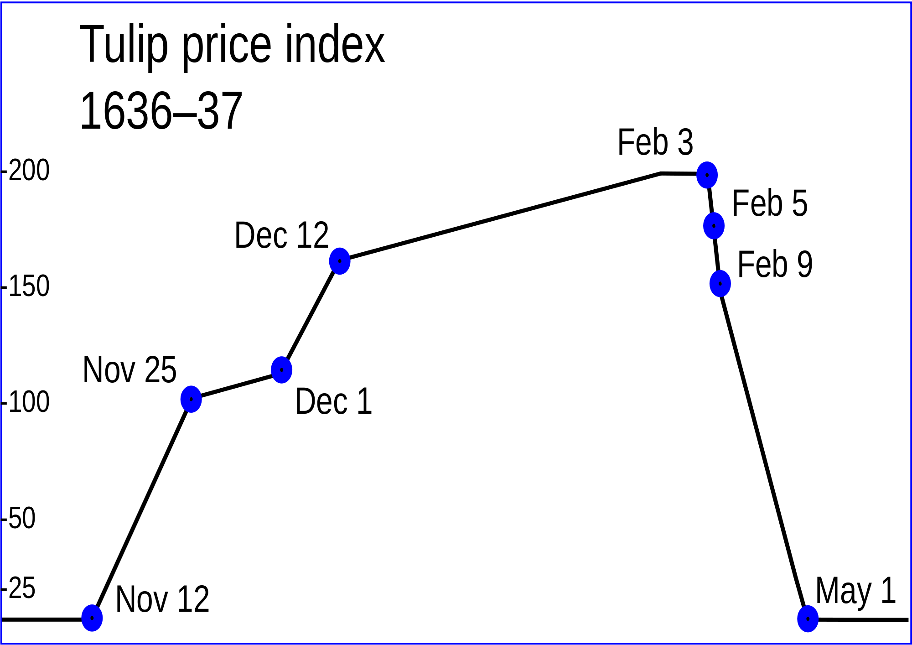
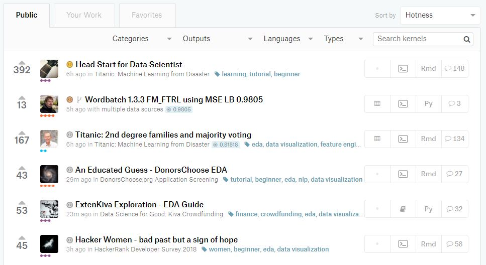
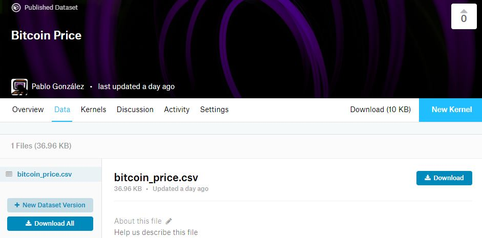
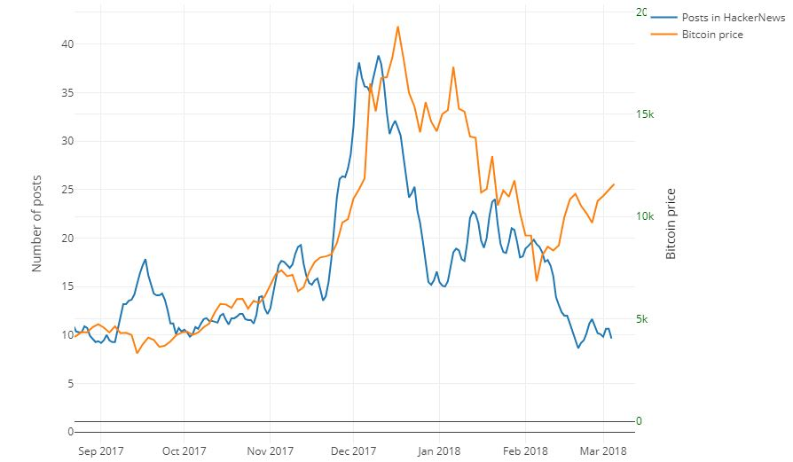

En este artículo veremos dos herramientas de gran importancia para
aficionados al anáisis de datos: **BigQuery** y **Kaggle** Para ello,
nos centraremos en un ejemplo concreto: intentaremos ver la
relación entre el **precio del Bitcoin** y la cantidad de noticias
relacionadas con el mismo en **HackerNews**, un conocido agregador de
noticias de tecnología y emprendimiento.


**Info** En [este
enlace](https://www.kaggle.com/unmonoqueteclea/hackernews-bitcoin) os
dejo el Kaggle Kernel con todo el análisis realizado del que hablaré
en este artículo.


## Precio del Bitcoin
Como ya es conocido por todos, las criptomonedas tienen una
**volatilidad altísima**. Para muchos, invertir en ellas es poco más
que comprar varios boletos de lotería, o apostar a rojo o negro en una
ruleta de un casino. Quizás, el error fue considerar que las
criptomonedas son unas divisas más. Una moneda es emitida por un banco
central y está regulada. El Bitcoin no cumple nada de esto. Sus curvas
de crecimiento ya superan con creces a las de las mayores **burbujas**
de la historia de la economía. Muchos lo relacionan con [la crisis de
los
tulipanes](http://www.eleconomista.es/divisas/noticias/8805544/12/17/El-bitcoin-supera-ya-a-los-tulipanes-como-la-burbuja-mas-grande-de-la-historia.html). Si
no conocéis esta famosa burbuja, que ocurrió hace más de 400 años,
recomiendo leer sobre ella. Fue un caso de *locura colectiva* que
acabó con una burbuja que, al estallar, tuvo consecuencias
devastadoras.

{:class="img-responsive center-image"}


Sin embargo, no todo el mundo es tan negativo respecto a las
criptomonedas. Existe quien considera que esta moneda virtual
descentralizada es una **auténtica revolución** que ha venido para
quedarse. Por sus características, **los modelos de la economía
tradicional no nos sirven prácticamente de nada con las
criptomonedas** y habría que incorporar nuevos factores a las
ecuaciones. Constantemente vemos que el precio del Bitcoin experimenta
crecimientos y caídas muy rápidos. Las causas de los mismos suelen ser
noticias que aparecen en los medios que incluso, en muchas ocasiones,
no son auténticas.. Cualquier noticia relacionada con las
criptomonedas afecta a la **confianza de los inversores** y tiene
efectos directos en el precio del Bitcoin. Por ello, en este artículo
nos hemos propuesto ver cómo se relaciona la cantidad de noticias
sobre Bitcoin con el precio del mismo.

## ¿Qué es Kaggle?
Para el análisis de los datos en este artículo usaremos
[**Kaggle**](https://www.kaggle.com/). Todo aficionado a la ciencia de
datos debería conocer Kaggle. Kaggle surge en 2010 como una plataforma
para la realización de competiciones de análisis y visualización de
datos.

{:class="img-responsive center-image"}

Su aceptación fue tan grande que en 2017 **Kaggle fue adquirida por
Google**. Lo que empezó como una pequeña web para alojar estas
competiciones, se ha convertido en el portal de referencia de todo
científico de datos. Además de las **competiciones**, cuyos premios
fácilmente pueden llegar hasta los cientos de miles dólares, Kaggle
dispone de una gran cantidad de **datasets**, **foros** muy activos,
**ranking** de usuarios e incluso un apartado donde empresas del
sector publican **ofertas de trabajo**.


Además, Kaggle ha incorporado los [**Kaggle
Kernels**](http://blog.kaggle.com/2016/07/08/kaggle-kernel-a-new-name-for-scripts/). Los
Kernels son una combinación de entornos de programación, datos de
entrada, código del análisis de estos datos y datos de salida. Todo
esto, empaquetado para cada versión del Kernel que creemos. Estos
Kernels corren en [Docker
containers](https://registry.hub.docker.com/repos/kaggle/) por lo que
tenemos la posibilidad de ejecutar todo este análisis en la nube [(con
ciertas limitaciones)](https://www.kaggle.com/wiki/Scripts). Los
Kernels son, por lo tanto, una estupenda forma de compartir nuestro
trabajo y aprender del de otros (podemos elegir si el Kernel que
creamos será público o privado). Incluso es posible hacer un *fork* o
añadir comentarios a los mismos. Además, Kaggle premia cada cierto
tiempo los mejores kernels públicos.

{:class="img-responsive center-image"}


Por si todo lo anterior fuese poco, los Kernel pueden contener
[**Jupyter
Notebooks**](http://jupyter-notebook-beginner-guide.readthedocs.io/en/latest/what_is_jupyter.html),
convirtiéndolos en la herramienta perfecta para muchos profesionales y
aficionados al Machine Learning.

## ¿Y BigQuery?
[**BigQuery**](https://cloud.google.com/bigquery/) es un servicio de
Big Data de Google que permite realizar consultas, con una sintaxis
muy similar a la de SQL, sobre inmensos conjuntos de datos de hasta
varios terabytes en apenas segundos. [La tecnología que subyace a
Google BigQuery, es
**Dremel**](https://cloud.google.com/files/BigQueryTechnicalWP.pdf). Esta
tecnología es capaz de escanear 35000 millones de filas no indexadas
en apenas 10 segundos. Si hacemos consultas a BigQuery desde Kaggle,
**podremos analizar hasta 5TB de datos al mes de forma totalmente
gratuita**.

{:class="img-responsive center-image"}

## Dataset de Hacker News
Existen varios datasets públicos que pueden ser analizados por
cualquier usuario de BigQuery. Uno de ellos, que usaremos en este
artículo es [el de Hacker
News](https://console.cloud.google.com/bigquery?p=bigquery-public-data&d=hacker_news&page=dataset).

{:class="img-responsive center-image"}

[HackerNews](https://news.ycombinator.com/) es un portal web donde los
usuarios recopilan y comentan noticias relacionadas con tecnología y
emprendimiento. En BigQuery tenemos todas las noticias que han
aparecido en el portal desde su inicio.

## Histórico de precios del Bitcoin
 La información sobre el valor del Bitcoin en dólares a lo largo del
 tiempo la hemos obtenido de la web
 [blockchain.info](https://blockchain.info/charts/market-price), que
 permite elegir un intervalo temporal y descargar todos los valores en
 un archivo *.csv*. Para poder usarlo dentro de nuestro *Kaggle
 Kernel* hemos tenido que crear un nuevo dataset, y añadir el fichero
 *csv* al mismo.

{:class="img-responsive center-image"}


**Info** Cada vez que queramos usar un fichero en un Kaggle Kernel
tendremos que hacerlo de esta forma, creando un nuevo dataset o
añadiéndolo a uno existente. Posteriormente, tendremos que indicar en
nuestro Kernel que queremos usar ese dataset.


## Querying Hackernews Data
Como comentábamos anteriormente, la sintaxis para realizar las
consultas a BigQuery es muy similar a la de **SQL** (aunque bastante
más limitada). En nuestro caso, la consulta que tendremos que realizar
será la siguiente:

```sql
SELECT title,score,time
FROM `bigquery-public-data.hacker_news.full`
WHERE REGEXP_CONTAINS(title, r"(b|B)itcoin") AND type = "story"
ORDER BY time
```


## Word Cloud
A partir de los titulares de todas las noticias que contienen la
palabra **Bitcoin** hemos creado una nube de palabras mediante la
librería [wordcloud](https://github.com/amueller/word_cloud) de
Python. El resultado ha sido el siguiente:

{:class="img-responsive center-image"}

Mediante esta librería, crear los word cloud es muy fácil.

```python
words = ' '.join(hn_query_result.title).lower()
cloud = wordcloud.WordCloud(background_color='black',
                            max_font_size=220,
                            width=1800,
                            height=1000,
                            max_words=200,
                            collocations=False,
                            relative_scaling=.5).generate(words)
```

Como vemos, no hay más que hacer un join de todos los titulares
obtenidos y pasárselo, junto con unos pequeños parámetros de
configuración.

**¡Ojo!** Un parámetro de configuración muy importante de esta
librería es el de **collocations**. Si lo ponemos a **True**, la
librería no hará el análisis estadístico de palabras aisaladas sino
que también intentará detectar bigramas: secuencias formadas por 2
palabras que se repiten varias veces.


## Visualizando Artículos en Hacker News vs Precio del Bitcoin
Una vez obtenidos todos los datos, realizaremos un último paso antes
de mostrarlos. El número de artículos hablando sobre Bitcoin en Hacker
News es una variable muy inestable, con cambios muy abruptos. Para una
visualización más cómoda, queremos suavizar la forma de esa
gráfica. Gracias a que hemos usado la librería
[**Pandas**](https://pandas.pydata.org/), realizar este suavizado es
extremadamente sencillo. Mediante la combinación de las funciones
**rolling()** y **mean()** podemos aplicar una ventana con un número
determinado de valores (en nuestro caso 11) que se va desplazando por
la gráfica calculando el valor medio de todos los valores que quedan
dentro de ella. Con ello, conseguimos una señal suavizada (filto paso
bajo)

```python
#Smooth averaging groups of 11 values
hn_count_mean_11=pd.Series(hn_count).rolling(11,center=True).mean()
```

Para la visualización de los datos hemos utilizado la librería
**Plotly** de la que me declaro fan incondicional y que nos permite
maravillas como la de poder incrustar en este post la gráfica obtenida
que vemos más abajo:


<iframe width="650" height="400" frameborder="0" scrolling="no" src="//plot.ly/~unmonoqueteclea/1.embed"></iframe>


No es suficiente para afirmar que podemos crear un modelo que nos
permita **realizar una predicción del precio del Bitcoin** en base a
esta variable. Sin embargo, sí que vemos que, en muchos casos, ambas
curvas son muy parecidas. Vemos un caso muy claro en Noviembre
de 2017. A partir de ese mes, se produjo una increíble subida del
precio del Bitcoin, que se vio perfectamente reflejada en la cantidad
de posts hablando sobre el Bitcoin en HackerNews. Sin embargo, el
interés por el Bitcoin en HackerNews comenzó a decrecer de forma
drástica (unos 10 posts menos al día) a partir de principios de
Diciembre. Pocos días después, el precio del Bitcoin se desplomó. En
la siguiente imagen vemos el intervalo de tiempo del que hablo:

{:class="img-responsive center-image"}


Aunque hemos hecho una primera aproximación, faltaría aún mucho
trabajo para realizar un modelo de predicción del precio del
Bitcoin. No me cabe duda (y si me animo algún día, trabajaré sobre
ello) que un modelo más avanzado que, en vez de centrarse en la
cantidad de artículos aplicara **algoritmos de Procesamiento Natural
del Lenguaje sobre el contenido de las noticias**, permitiría obtener
una predicción de mayor calidad. Pero eso lo dejamos para otro día...

<style>
.center-image{
    margin: 0 auto;
    display: block;
}
</style>
