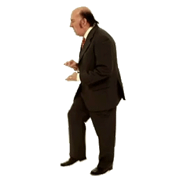
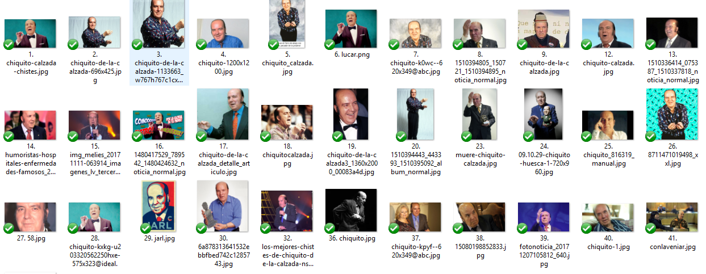
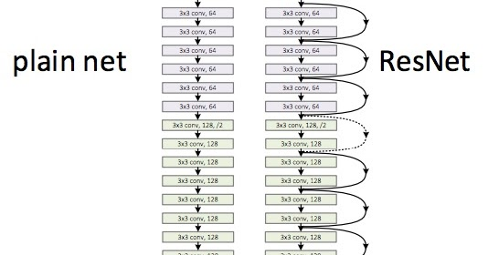
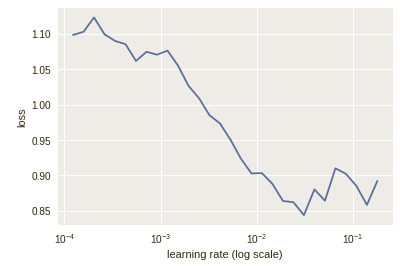
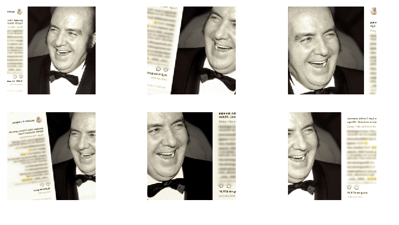
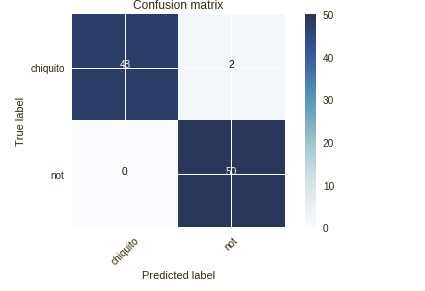

**Update 12/01/2020**. Este artículo es de 2018, y usa una de las
primeras versiones de la librería [**Fast AI**](https://docs.fast.ai/)
Como es inevitable, a los pocos meses de su creación el código de este
tipo de artículos queda desactualizado. Sin embargo, las técnicas que
se detallan para la realización del clasificador (extracción de datos,
*fine-tunning*, *data augmentation*, etc) seguirán de actualidad
durante mucho más tiempo.


Hoy vamos a hacer nuestro primer proyecto basado en **Deep Learning**,
y como la ocasión lo merece, el clasificador que realizaremos será
capaz de detectar imágenes en las que aparezca **Chiquito de la
Calzada**.

{:class="img-responsive center-image"}

 Para ello, vamos a usar la librería de [**Fast
 AI**](http://fast.ai). Esta librería, que funciona sobre
 [**PyTorch**](https://pytorch.org/), nos ofrece funciones de muy alto
 nivel que encapsulan una gran cantidad de líneas de código para
 realizar proyectos de Deep Learning. Como veremos después, con 3
 líneas de código podemos realizar un clasificador que nos proporcione
 unos resultados bastante decentes. Este artículo está basado en las
 dos primeras lecciones del curso [Practical Deep Learning for
 Coders](http://course.fast.ai/).

Con este método conseguiremos un **porcentaje de acierto del 98%**.

 **Info** La libreta de Jupyter que acompaña a este artículo se puede
descargar y consultar
[aquí](https://colab.research.google.com/drive/1euOY5_mxvJv7RQwMtKo1QWU3Vhog6yEa).
{: .notice--info}


## Obteniendo imágenes
Por desgracia, que sepamos, no existe ningún dataset público de
imágenes de Chiquito. Por lo tanto, tendremos que obtener nosotros
todas las imágenes que podamos. Por suerte, alguien pensó en nosotros
y creó [esta
librería](https://github.com/hardikvasa/google-images-download) que
permite automatizar la descarga de imágenes de Google Imágenes.

La librería es muy fácil de usar. La instalaremos mediante **pip**:

```bash
pip install google_images_download
```

Tras ello, crearemos nuestro archivo de configuración, que llamaremos
**config.json**, y tendrá el siguiente contenido:

```json
{
    "Records": [
        {
            "keywords": "chiquito de la calzada",
            "limit": 800,
            "print_urls": true,
            "chromedriver":"C:\\path\\to\\chromedriver.exe"
        }
    ]
}
```

Con esta configuración, estamos diciendo al programa que queremos que
realice una búsqueda del término "*chiquito de la calzada*" en Google
Imágenes y descargue hasta 800 imágenes. Además, le tenemos que pasar
la ruta del **chromedriver**, que en caso de no tenerlo, lo podemos
descargar de [aquí](http://chromedriver.chromium.org/).

Tras ello, habrá que escribir lo siguiente en la consola de
**Anaconda** (Yo uso Anaconda, pero esto no es un requisito
indispensable):

```bash
googleimagesdownload -cf config.json
```

Si no estamos en el mismo directorio que nuestro archivo
**config.json** habrá que especificarle la ruta completa.

Tras unos minutos, tendremos una carpeta llena de fotos de Chiquito de
la Calzada. **Haremos una pequeña limpieza de los datos**, eliminando
fotos con formatos no válidos (*.gif*) o que tienen mala profundidad
de color (8 bits). Además tendremos que fijarnos, porque puede que
Google nos haya colado alguna imagen que en realidad no sea de
chiquito.

{:class="img-responsive center-image"}

Como siempre, para entrenar nuestro clasificador necesitaremos
ejemplos positivos y ejemplos negativos. Por lo tanto, necesitamos
imágenes donde NO aparezca chiquito. Para ello, hemos usado el dataset
**Labeled Faces in the Wild**, que podemos descargar
[aquí](http://vis-www.cs.umass.edu/lfw/lfw.tgz). Este dataset contiene
fotos de las caras de 1680 famosos.


{:class="img-responsive center-image"}


Al descargarlo, vemos que existe un nuevo problema, las imágenes están
en subcarpetas con el nombre de cada personaje. Necesitamos tener
todas las imágenes en la misma carpeta por lo que he realizado este
pequeño script para esta tarea:

```python
import os
from shutil import copy
import random
from os import listdir
from os.path import isfile, join

path = "C:\\path\\to\\lfw"
folders = [x[0] for x in os.walk(path)]

rnd_numbers=[]

#Change this number to the number of photos that you have in your Chiquito dataset
num_images=270

while(len(rnd_numbers)<270):
    num = random.randint(0,len(folders)-1)
    if(not (num in rnd_numbers)):
        rnd_numbers.append(num)

for num in rnd_numbers:
    onlyfiles = [f for f in listdir(folders[num]) if isfile(join(folders[num], f))]
    image = folders[num]+"\\"+onlyfiles[0]
    copy(image,path)

print("\n Finished")
```

Con este script, tomamos 270 imágenes aleatorias y las pasamos a una
misma carpeta. Para tener un dataset bien balanceado, deberemos tener
el mismo número de muestras positivas que negativas, es decir, el
mismo número de imágenes de chiquito, que de otro tipo.

Hay otra última cosa que tenemos que hacer para tener nuestro dataset
preparado. Nuestro dataset debe estar compuesto por las carpetas
**train** y **valid**. Cada una de ellas, contendrán a su vez las
carpetas **chiquito** y **not**. Pasaremos 220 imágenes de cada tipo a
la carpeta de entrenamiento (train) y 50 imágenes de cada tipo a la
carpeta de validación (valid). Si tienes alguna duda, puedes descargar
el [dataset de
ejemplo](https://github.com/unmonoqueteclea/DeepLearning-Notebooks/blob/master/ChiqutoOrNot/dataset.zip?raw=true).

## Creando nuestro clasificador
Para no hacer un artículo demasiado largo, vamos a poner sólo las
principales instrucciones. Para reproducir por completo todo el
proceso, recomendamos ver la [libreta de Jupyter en Google
Colab](https://colab.research.google.com/drive/1euOY5_mxvJv7RQwMtKo1QWU3Vhog6yEa),
donde está todo el proceso comentado.

Comenzamos importando todos los módulos necesarios y le pasamos la
ruta de nuestro dataset.  Además, configuraremos el tamaño de imágenes
que usará la librería.

Utilizamos una técnica basada de **Transfer Learning**, es decir,
partimos de un modelo pre-entrenado, y con los pesos *congelados* y
añadimos después una capa cuyos pesos entrenaremos con nuestro
dataset. Partimos de la arquitectura
[resnet](https://arxiv.org/abs/1512.03385), que es utilizada en
multitud de ocasiones en este tipo de tareas.

{:class="img-responsive center-image"}

En las dos últimas línea estamos utilizando una característica de la
librería **Fast AI** que nos permite ver cómo se comporta nuestro
modelo en función del learning rate elegido.

```python
# This file contains all the main external libs we'll use
from fastai.imports import *
from fastai.transforms import *
from fastai.conv_learner import *
from fastai.model import *
from fastai.dataset import *
from fastai.sgdr import *
from fastai.plots import *

PATH = "data/dataset/"
size=224
arch=resnet34
#Creating classifier
data = ImageClassifierData.from_paths(PATH, tfms=tfms_from_model(arch, sz), bs=8)
learn = ConvLearner.pretrained(arch, data, precompute=True)
lrf=learn.lr_find()
learn.sched.plot()
```

Del código anterior obtenemos la siguiente gráfica:

{:class="img-responsive center-image"}

Basándonos en el paper [Cyclical Learning Rates for Training Neural
Networks](http://arxiv.org/abs/1506.01186), escogeremos **0.01** como
valor máximo para nuestro **learning rate**, pues es el valor más
alto, para el que el error sigue descendiendo.  Ahora, simplemente
tendremos que escribir la siguiente línea para entrenar nuestra red:

```python
learn.fit(0.01, 2)
```

Es importante recordar, que los pesos de nuestra red están
*congelados*, por lo que únicamente estamos entrenando la última
capa. Aún así, podemos ver que conseguimos una **precisión del
92%**. No está nada mal.

## Data Augmentation
Una posible opción para mejorar nuestra precisión final, es realizar
la tarea conocida como **Data Augmentation**. Esta tarea consiste en
la ejecución de operaciones como rotación, translación y zoom de forma
aleatoria sobre las imágenes. Con esto conseguimos evitar el
**overfitting** (que nuestra red se aprenda las imágenes y no sea
capaz de generalizar). Si le pasamos a la red versiones modificadas de
la misma imagen, ésta será capaz de aprender características
intrínsecas del objeto, y será capaz de generalizar mejor. En la
siguiente imagen podemos ver el resultado de aplicar esta técnica a
una foto en concreto.

{:class="img-responsive center-image"}


Tras ello, volveremos a entrenar nuestra red, obteniendo ahora un **95% de eficacia**.

```python
tfms = tfms_from_model(resnet34, sz, aug_tfms=transforms_side_on, max_zoom=1.3)
data = ImageClassifierData.from_paths(PATH, tfms=tfms)
learn = ConvLearner.pretrained(arch, data, precompute=False)
learn.fit(1e-2, 4, cycle_len=1)
```

## Fine tunning
La última técnica que aplicaremos para mejorar aún más nuestra
eficacia, es la conocida como **fine tunning**. Lo que haremos es
*descongelar* los pesos de las capas convolucionales, para que la red
completa pueda ser entrenada. Sin embargo, estos pesos contienen
información que nos puede ser de gran utilidad. Además, sabemos que
las primeras capas de una red convolucional tienen información más
general, que va siendo más específica según vamos avanzando a capas
posteriores. Es por ello por lo que definiremos un array con 3
learning rates distintos, siendo el más bajo el de la primera capa. De
esta forma, nos aseguramos realizar *pequeños retoques* sin perder el
conocimiento general de la red.


```python
learn.unfreeze()
lr=np.array([1e-4,1e-3,1e-2])
learn.fit(lr, 3, cycle_len=1, cycle_mult=2)
```

Tras esto, conseguimos un **porcentaje de acierto del 98%**. Como
vemos en la matriz de confusión de abajo, nuestra red sólo falla con 2
de las imágenes:


{:class="img-responsive center-image"}


¡No está nada mal para ser nuestra primera aproximación al Deep Learning!
¡Ya estamos preparados para hacerle competencia a **Hot Dog Or Not**!

<div class="embed-responsive embed-responsive-16by9">
  <iframe class="embed-responsive-item" width="700"
          height="700" src="https://www.youtube.com/embed/vIci3C4JkL0"
          frameborder="0" allow="autoplay; encrypted-media"
          allowfullscreen></iframe>
</div>

<style>
.center-image{
    margin: 0 auto;
    display: block;
}
</style>
