In this post, we will learn how to create a Deep Learning model, and make a Kaggle submission for a competition **without writing a line of code**. Yes, it is possible! [BigML](https://bigml.com) helps us to do it.

 **Warning** This post is not a tutorial, I will omit some information about how things are done. It´s just a demostration of how powerful can this tool be. In 3 or 4 hours, you can know perfectly all the platform with [these videos](https://youtube.com/playlist?list=PL1bKyu9GtNYHAk0PUojkLYZzASoYVcsTQ)
{: .notice--info}

## What is BigML
BigML is a Machine Learning platform with a simple and clear mission: make Machine Learning easy, beautiful, and understandable for everybody. Without any profound knowledge of Machine Learning, and in just 3 or 4 clicks, as we will see later, you can create a ML model with a performance similar to the state-of-the-art-models.

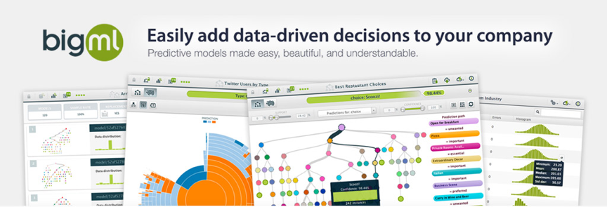{:class="img-responsive center-image"}

## Creating our dataset
We want to make a submission to [this **fake news** detection
competition](https://kaggle.com/c/fake-news). Seems to be a big
challenge! First of all, we will download **train.csv** and
**test.csv** files from Kaggle.

{:class="img-responsive center-image"}

Now, we should upload them to BigML. BigML distinguishes between **Sources** and **Datasets**, so, the first thing we should do is uploading the CSV files to Sources. We will navigate to the [Dashboard page](https://bigml.com/dashboard) and click on the **Sources** tab. Then, we will upload our **train.csv** and **test.csv** files. We will rename the sources to **FakeNews** and **FakeNews Kaggle Test**.

{:class="img-responsive center-image"}

After making some comprobations of the data type of all fields, we sould click on **1-Click dataset** to create our dataset from each one of the sources. Now, our datasets will appear on **Datasets** tab. If we click on one of them, we can see some useful information:

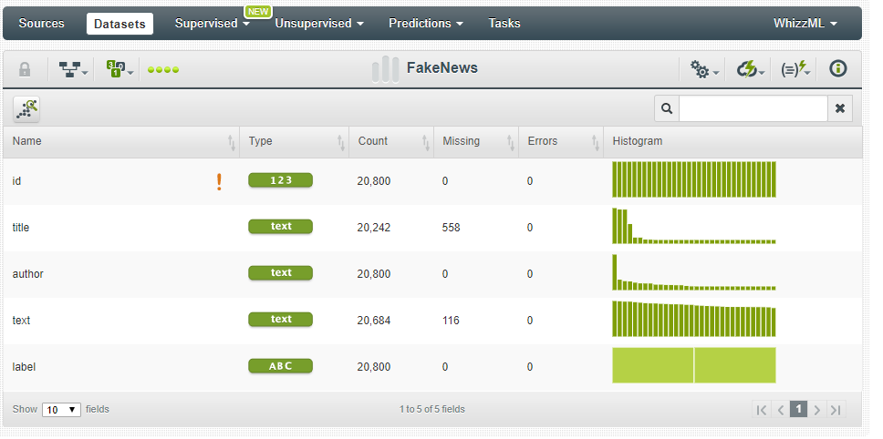{:class="img-responsive center-image"}

Creating train/test split is as easy as clicking this button:

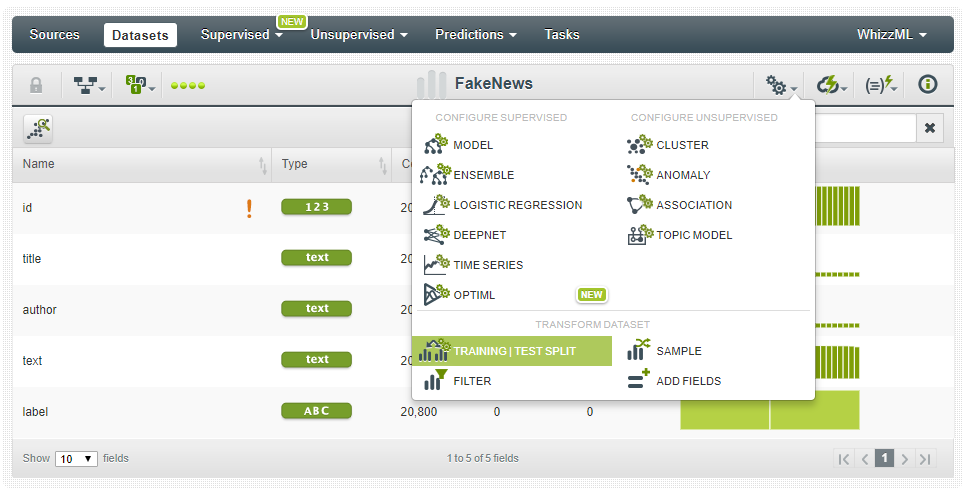{:class="img-responsive center-image"}

## Creating Deep Learning Model
Creating our **Deep Neural Network model** will only consist on
clicking this icon from the training dataset view:

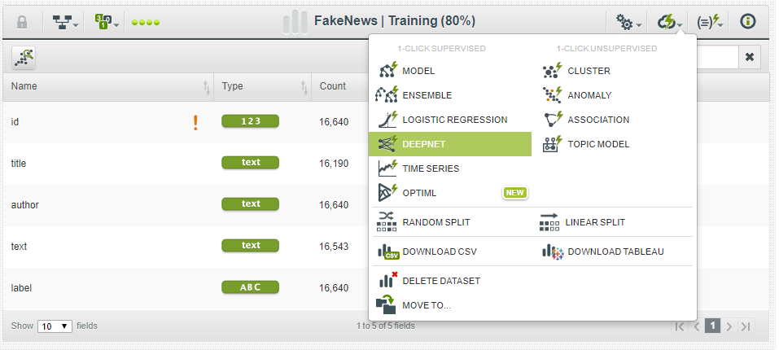{:class="img-responsive center-image"}

Only one click to create a fully functional deep learning model!

If we open **Deepnets** option inside Supervised menu tab, we will
see, *after some minutes*, our model. With only one more click, we
will be able to perform the evaluation, using the test dataset (the
one that comes from the train/test split). Actually, this would be
**Validation** dataset. The **Test** dataset would be the one that we
have obtained, without labels, from Kaggle.

{:class="img-responsive center-image"}

As we can see, we have achieved an accuracy of 97.7% in the test set. Taking into account that we have made 5 or 6 clicks, this is such a very good result!

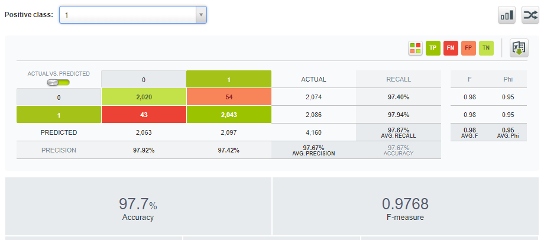{:class="img-responsive center-image"}

 **One trick!** You can use **OptiML** option within BigML to
automatically find the best model and hyperparameters.

## Test prediction
Finally, let´s test our model with the Kaggle test dataset.

We will click on **Create Batch Prediction**: {:class="img-responsive
center-image"}

We will configure it to generate the output needed for the competition:

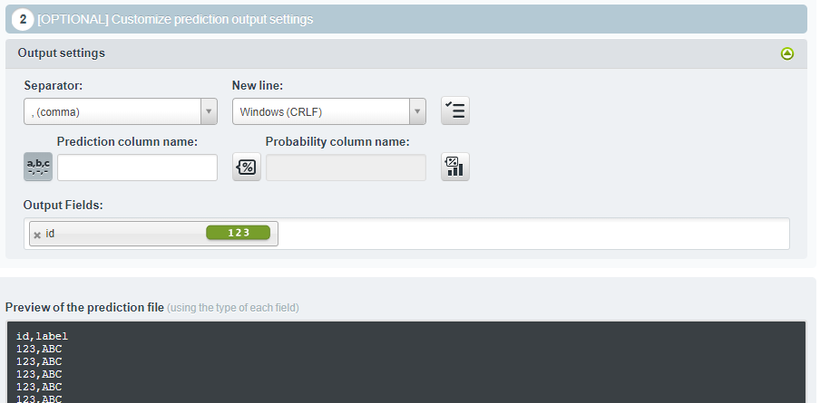{:class="img-responsive center-image"}

After the evaluation is finished, we should click on **Download batch prediction** and upload the generated CSV into the Kaggle competition submission tab. **We have achieved an score of 0.97564** so we would be in the **third position of the ranking** with only one submission!

Sadly, the competition finished few months ago...

{:class="img-responsive center-image"}

## One more thing...Topic modelling
BigML has also some very interesting **Unsupervised Learning tools**. We will try one of them: **Topic Model**. This is a clustering algorithm that creates groups of similar words (that belongs to the same topic). We want to see the most usual topics of fake news. We will start filtering only fake news.

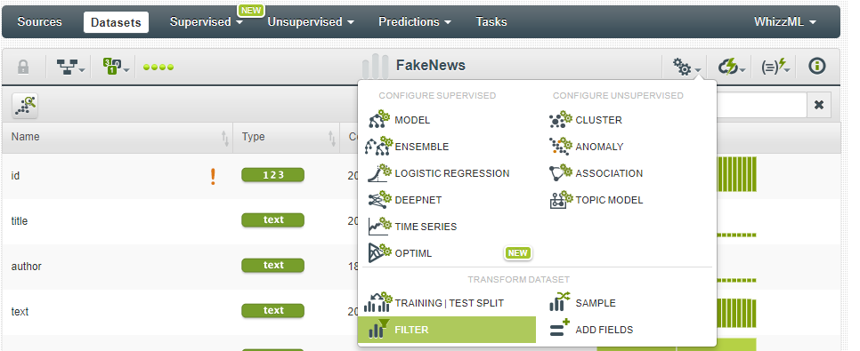{:class="img-responsive center-image"}

We will use this filter:

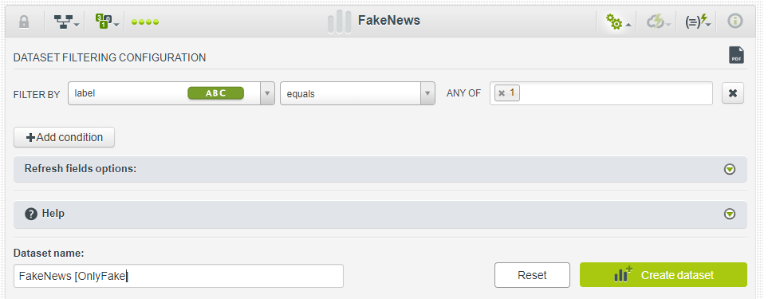{:class="img-responsive center-image"}

With this new dataset, we will create a **Topic Model** with these options:

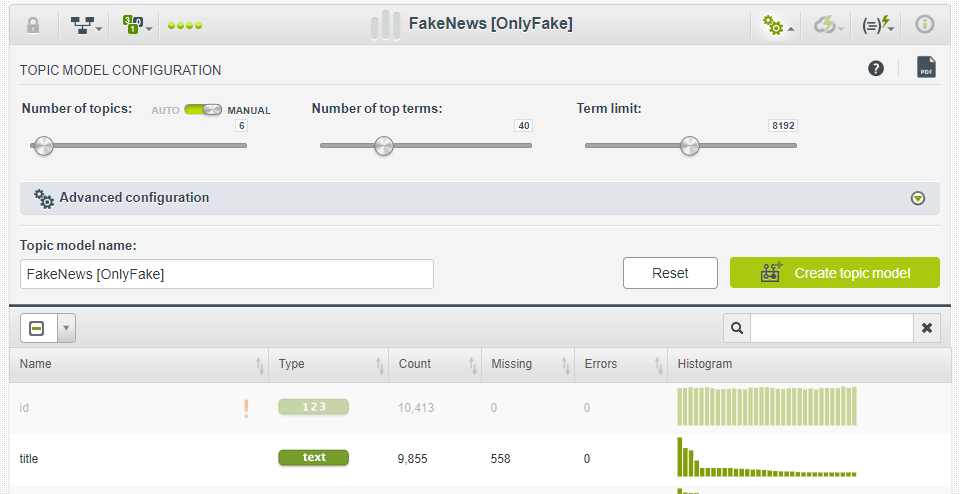{:class="img-responsive center-image"}

As we can see below, there are 6 different groups of words, relationated to 6 different topics. We have manually assigned a name to each topic.

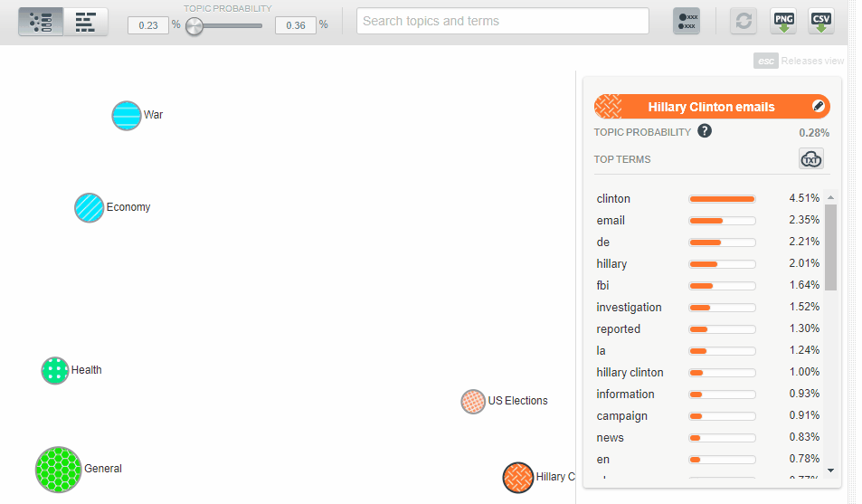{:class="img-responsive center-image"}

Finally, let´s see how powerful this tool is, Let´s write some
invented titles, and see how the model is able to classify them.

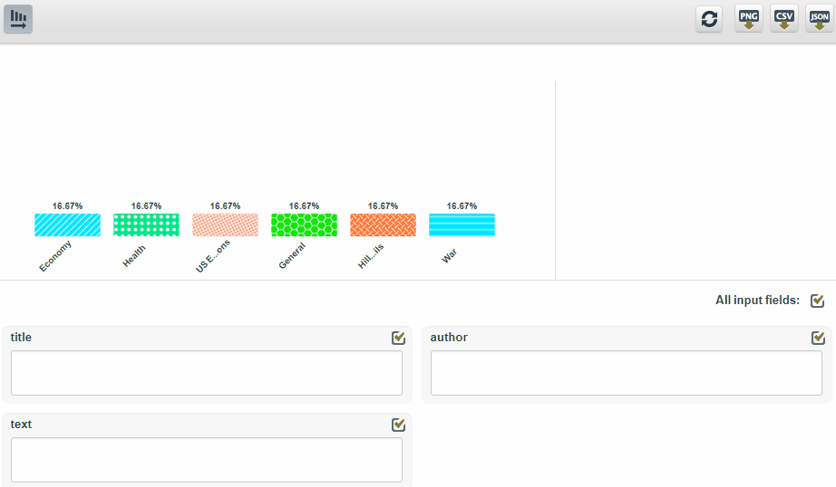{:class="img-responsive center-image"}

